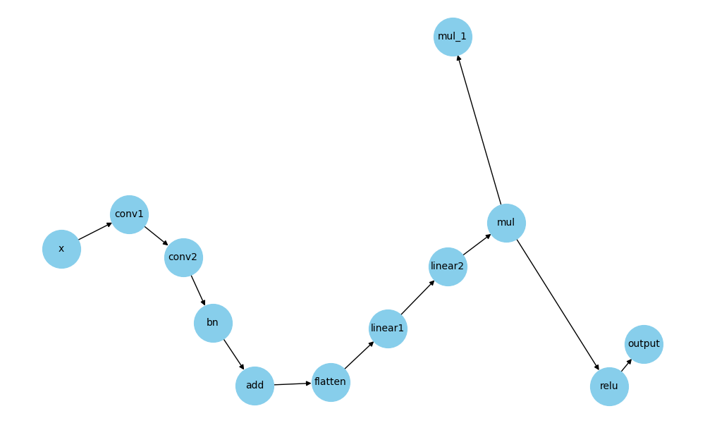
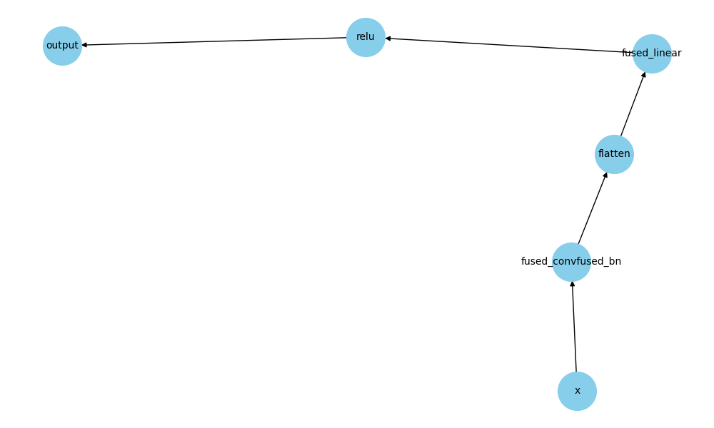

# Neural Optimizer

A lightweight framework to optimize PyTorch models by rewriting computation graphs using `torch.fx`.  

### Features
- Custom tracer for capturing models with redundant or simplify-able ops
- Graph-level optimization passes for improving runtime efficiency
- Designed for inference-time optimization (post-training; weights must be defined)
- Tests to check both models give the same output
- Automated tests that compare the outputs of the original and optimized models to ensure numerical equivalence (with a small error tolerance)

### Optimization Passes
- Conv → Conv fusion
- Linear → Linear fusion
- Conv → BatchNorm fusion
- Float simplification
- Constant folding
- Dead code elimination

### Example Optimization

**Before Optimization**  


**After Optimization**    


### Limitations
- Optimizations are valid **only after model weights are initialized**
- Not intended for training-time graph rewriting (may break backprop or introduce inaccuracies during gradient computation)


### Setup (with virtual environment)

```bash
# Create a virtual environment
python -m venv .venv

# Activate it
# On macOS/Linux:
source .venv/bin/activate
# On Windows:
.venv\Scripts\activate

# Set PYTHONPATH to the current working directory
export PYTHONPATH=$(pwd)

# Install dependencies
pip install -r requirements.txt
```

### Running the Project
```bash
python main.py
```

### Running Tests
```bash
pytest -sq > tests/test.log
```


